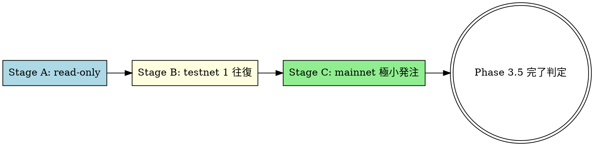

# HL mainnet 段階的検証 (C-1) 設計

**作成日**: 2026-05-05
**ブランチ**: develop からの新規 feature branch (実装時に作成)
**前提資料**: `docs/HANDOFF-2026-05-04.md`, `docs/TODO.md` (Phase 3.5 Step A〜F)

## 1. 目的

Hyperliquid (HL) の mainnet と testnet を組み合わせ, 既存ポジ・注文に**影響ゼロ**で
Rust executor (`executor-hl` crate) の `RealHlClient` を **read-only → testnet 1 往復 → mainnet 極小発注** の
3 段階で実環境検証する.

検証目的:

1. `RealHlClient::fetch_account_state` / `fetch_book_snapshot` のレスポンスパーサ完成
2. `Eip712AgentSigner` の HL python-sdk との cross-check 一致確認
3. `RealHlClient::place_orders` / `cancel_orders` の wire format 確定
4. `executor-hl` が本番投入可能であることのエビデンス取得 (Phase 3.5 完成判定の前段)

## 2. 非目的

以下は本設計の対象外:

- **WS subscriber の本実装** (Phase 3.5 Step D で別途)
- **executor-server の Auth レイヤ** (Step E, reverse proxy 設計)
- **MARKET_MAKE / TWAP の本格運用** (Phase 3.5 Step F testnet smoke で別途)
- **dynamic slippage / multi-process 並列** (Phase 3.5 任意項目)

## 3. 制約と前提

### 3.1 既存 mainnet ポジション・注文 (read-only snapshot 2026-05-05 取得)

Master EOA (mask: `0xfe3e...7d2d`, `userRole=user`) は以下を保有:

| dex | 種別 | symbol | 詳細 (要約のみ、本 doc では伏せる) |
|---|---|---|---|
| default | perp position | **HYPE** | long, cross, marginUsed≈$609 |
| xyz (HIP-3) | perp position | **xyz:META** | long, cross, marginUsed≈$199 |
| xyz | perp open order | **xyz:GOOGL** | bid 1 件 |
| spot | balance | USDC | total≈$2,477 (内 hold≈$1,162) |

→ **テスト発注で絶対に触れてはならないシンボル**: `HYPE`, `xyz:META`, `xyz:GOOGL`

### 3.2 マージン余力 (default dex)

- `accountValue=$643.72`, `totalMarginUsed=$608.85` (94.6% 使用)
- `withdrawable=$34.87` (この範囲内でのみ新規 cross order 可)
- `liquidationPx (HYPE)=$27.03` (現値 $42.13 から -36% で清算)
- → 新規 cross order の証拠金は `withdrawable` から事前確保される (`accountValue` 自体は不変).
      ETH $5 notional × 10x leverage = $0.50 のため余裕は十分

### 3.3 ユーザー指定: テスト発注は **ETH** で実施 (mainnet)

- ETH は default dex 所属, perp universe (`maxLeverage=25`, `szDecimals=4`)
- HYPE / xyz:META / xyz:GOOGL とは完全に別シンボル
- 流動性十分 (best ± 数 tick で post-only ALO は通常 fill されない)
- 既存ポジ・注文と重複なし

### 3.4 鍵管理 (確定)

- agent wallet: `diff-new-old_02` (mask: `0xB2a7...b8c5`, valid until 2026/11/1 12:06:13)
- private key: `~/.password-store/diff-old-new/hl/agent-pk.gpg` (GPG 暗号化)
- env loader: `scripts/load-env.sh` (pass-store から `HL_AGENT_PK` を export)
- Claude (アシスタント) は `.claude/hooks/deny-pk-{access,read}.sh` で PK アクセス全面 block

### 3.5 公式仕様 (2026-05-05 確認)

- info endpoint: weight 2 = `l2Book / allMids / clearinghouseState / orderStatus / spotClearinghouseState / exchangeStatus`, それ以外は weight 20
- exchange endpoint: weight = `1 + floor(batch_length/40)`
- 全体: 1200 weight/min を超えると 429
- multi-dex 対応: HIP-3 dex (xyz, flx, vntl, hyna, km, abcd, cash, para) に同一 master EOA でアクセスする際は `dex` パラメータ必須

参考リンク:

- [Info endpoint](https://hyperliquid.gitbook.io/hyperliquid-docs/for-developers/api/info-endpoint)
- [Perpetuals](https://hyperliquid.gitbook.io/hyperliquid-docs/for-developers/api/info-endpoint/perpetuals)
- [Rate limits](https://hyperliquid.gitbook.io/hyperliquid-docs/for-developers/api/rate-limits-and-user-limits)

## 4. 全体フロー (3 ステージ)



各ステージは**独立した PR** で merge し, 失敗時にロールバック容易な単位で切る.

## 5. Stage A: mainnet read-only パーサ完成 (PR-A)

### 5.1 ゴール

`RealHlClient::fetch_account_state` および `fetch_book_snapshot` がレスポンスを完全パースし,
`AccountStateSnapshot` / `OrderBook` 構造体を正しく埋めることを確認する.

### 5.2 対象 endpoint と struct

| endpoint | 入力 | 出力 struct | 注意点 |
|---|---|---|---|
| `clearinghouseState` (default dex) | `{type, user}` | `AccountStateSnapshot` | weight 2, perp ポジ |
| `clearinghouseState` (HIP-3 dex) | `{type, user, dex}` | 同上 (dex 別) | dex ごとに weight 2 |
| `openOrders` (default + 各 dex) | `{type, user, dex?}` | `Vec<OpenOrder>` | weight 20 |
| `l2Book` | `{type, coin, nSigFigs?}` | `OrderBook` | weight 2 |
| `meta` | `{type, dex?}` | `Universe` | weight 20, 起動時 1 回キャッシュ |
| `userRole` | `{type, user}` | `Role` enum | weight 20, agent 誤指定検知 |

### 5.3 レスポンス schema (公式仕様より, snake_case で Rust struct 化)

```rust
// AccountStateSnapshot に追加するフィールド (executor-core の Position は既存)
pub struct AccountStateSnapshot {
    pub address: Address,
    pub margin_used: Decimal,                  // marginSummary.totalMarginUsed
    pub account_value: Decimal,                // marginSummary.accountValue
    pub withdrawable: Decimal,                 // withdrawable
    pub cross_maintenance_margin_used: Decimal,// crossMaintenanceMarginUsed
    pub positions: HashMap<Symbol, Position>,  // assetPositions[].position
    pub open_orders_by_cloid: HashMap<Cloid, OrderId>, // 別 endpoint で fetch して merge
    pub fetched_at: DateTime<Utc>,             // クライアント側生成
    pub server_time: DateTime<Utc>,            // response.time (ms epoch)
}

// position.leverage は existing struct に追加
pub struct Leverage {
    pub leverage_type: LeverageType, // "cross" | "isolated"
    pub value: u32,
    pub raw_usd: Option<Decimal>,    // isolated のみ
}

// open order は新 struct
pub struct OpenOrder {
    pub coin: Symbol,
    pub side: OrderSide,        // HL wire: "A"=ask=sell, "B"=bid=buy
    pub limit_px: Decimal,
    pub sz: Decimal,
    pub oid: OrderId,
    pub timestamp: DateTime<Utc>,
}

#[derive(Debug, Clone, Copy, PartialEq, Eq, Serialize, Deserialize)]
#[serde(rename_all = "UPPERCASE")]
pub enum OrderSide {
    A, // ask = sell
    B, // bid = buy
}
```

### 5.4 実装ポイント

- HL レスポンスの **数値は文字列** (`"643.718581"`). serde で `Decimal` に直接 deserialize するため
  `serde_with::DisplayFromStr` を使うか, custom deserializer を定義
- `userRole` を起動時に必ず check し, agent address で master 専用 endpoint を叩いた誤運用を即検知
- multi-dex 対応: HIP-3 dex の symbol は `xyz:META` のように prefix 付き. `Symbol::from_str` でこれを許容
- rate limit: 起動時 burst で `meta + clearinghouseState x 9 dexs + openOrders x 9 dexs ≒ weight 200` 程度.
  1200/min 余裕あり. 実装は existing `TokenBucket` (`hyperliquid_default()`) を流用

### 5.5 テスト

- **unit**: 既知 JSON fixture (`tests/fixtures/hl/clearinghouseState_*.json`) → struct パース検証
- **integration (オプション, marker `live`)**: 実 mainnet を read-only で叩き
  `assetPositions` count ≥ 0, `accountValue ≥ 0`, struct フィールド非欠落 を assert
  - 既存ポジ詳細を assert 文に書かない (test code に焼くと git に残る)
  - test fixture も sanitize した最小サンプルのみ commit
- **CI**: live test は `--ignored` または `[live]` feature gate で default オフ

### 5.6 受け入れ基準

- [ ] `cargo test -p executor-hl --test parse_clearinghouse_state` 全 pass
- [ ] `cargo test -p executor-hl --test parse_open_orders` 全 pass
- [ ] live integration test (marker 付き) で master EOA を叩いて `assetPositions=2, openOrders=1`
      (本日時点) を取得できる
- [ ] CI green (`cargo fmt`, `cargo clippy -D warnings`, ローカル `scripts/check_ci_local.sh`)

## 6. Stage B: testnet 1 往復 (PR-B)

### 6.1 ゴール

`Eip712AgentSigner` + `RealHlClient::place_orders` + `cancel_orders` を testnet で 1 度だけ
発注/キャンセル往復させ, 署名・wire format・キャンセル経路の 90% のバグを mainnet 前に検出する.

### 6.2 testnet 用 agent wallet の準備

mainnet 用 agent (`0xB2a7...b8c5`) は使わず, **testnet 専用に新規 generate** する.

理由:
- mainnet agent の PK 漏洩リスクを testnet 検証で広げない
- testnet HL は別 chain id (421614) で署名先が違う
- testnet agent も `~/.password-store/diff-old-new/hl-testnet/agent-pk.gpg` に保管

testnet faucet で USDC を $20 程度受け取り (Arbitrum Sepolia → HL testnet bridge).

### 6.3 `Eip712AgentSigner` 実装

参考実装: HL python-sdk `hyperliquid/utils/signing.py` (0.23.0 系)

主要構造体:

```rust
pub struct Eip712AgentSigner {
    pk: secrecy::Secret<[u8; 32]>,
    chain_id: u64,            // mainnet=42161, testnet=421614
    is_mainnet: bool,         // typed-data の HyperliquidChain "Mainnet"|"Testnet"
}

impl Signer for Eip712AgentSigner {
    fn sign_l1(&self, action: &Value, nonce: u64) -> Result<Signature, HlError> {
        // 1. action_hash = keccak256(serialize(action) || nonce_le_8 || vault_addr_or_null)
        // 2. typed_data = {
        //      domain: {
        //        name: "HyperliquidSignTransaction",
        //        version: "1",
        //        chainId: self.chain_id,
        //        verifyingContract: 0x000...
        //      },
        //      types: HyperliquidTransaction:Withdraw|Order|...,
        //      message: { ... }
        //    }
        // 3. eip712 hash = keccak256("\x19\x01" || domainSeparator || structHash)
        // 4. secp256k1 sign with self.pk
        // 5. RecoveryId 27/28 -> v
    }
}
```

### 6.4 cross-check テスト

HL python-sdk と同じ既知ベクタで signature が一致することを assert:

- `tests/fixtures/signing/known_vectors.json` に
  `{action, nonce, expected_r, expected_s, expected_v}` を 5 ケース格納
- python-sdk で生成 → JSON に書き出し → Rust 側で再現性 assert
- ベクタ生成スクリプト (`scripts/gen_known_vectors.py`) は HL python-sdk の例を流用

### 6.5 testnet 1 往復シナリオ

最小: ETH を mainnet と同等の安全装置で発注 → 即 cloid 指定キャンセル

- size: `0.002 ETH` (mainnet と同条件、$5〜$10 相当, ただし testnet なので fill しても損害ゼロ)
- price: best bid - 1.0% 以上下 (post-only ALO, side=B=buy)
- tif: `Alo`, `reduce_only=false`, `cloid=<uuid v7>`

手順:

1. testnet 用 `executor-server` 起動 (`HL_BASE=testnet`)
2. `executor-cli exec --algo passive --symbol ETH --intent open --size 0.002` 相当
3. server が `place_orders` を呼ぶ
4. fill されないことを 5s wait で確認
5. `executor-cli cancel <exec_id>` → `cancel_orders` 呼出
6. キャンセル成功確認
7. testnet `userFills` を見て fill が **0 件**であることを確認

### 6.6 受け入れ基準

- [ ] cross-check unit test 5/5 pass (Rust signature == python-sdk signature)
- [ ] testnet で 1 往復成功 (place→cancel, fill 0 件)
- [ ] `userFills` で実際にこの cloid が "canceled" 状態
- [ ] CI green

## 7. Stage C: mainnet 極小発注 (PR-C)

### 7.1 ゴール

mainnet 上で **ETH を最小 size で ALO post-only 発注 → 即 cloid キャンセル** を 1 往復成功させ,
既存ポジ (HYPE, xyz:META, xyz:GOOGL) に**一切影響を与えない**ことを read-only diff で検証する.

### 7.2 安全装置 (4 重)

#### 7.2.1 シンボル allowlist

executor-server に `--mainnet-allow-symbols ETH` フラグを追加. allowlist 外への発注を rejection する.
ハードコード `BLOCK = ["HYPE", "xyz:META", "xyz:GOOGL"]` も併用 (defense in depth).

#### 7.2.2 size 上限

`--mainnet-max-notional-usd 10` で 1 注文当たり $10 を超えたら server 側 reject.

#### 7.2.3 baseline-diff guard

発注前後で master EOA の `clearinghouseState` を取得し,
- HYPE position の `szi` が変化していたら **alert + abort**
- xyz:META の `szi` が変化していたら同上
- xyz:GOOGL の open order が消えていたら同上

#### 7.2.4 ALO post-only かつ best-far

買いの場合は ETH の **best bid から -1.0% 以上下** にした price で post-only ALO 発注 (= bid 板の深い位置に並ぶ).
売りの場合は best ask から **+1.0% 以上上**.
いずれも反対側のクロスは絶対起こらず fill 0 を物理的に保証する.
HL は post-only ALO がクロスするオーダーは即時 rejection するため, さらに保険になる.

### 7.3 シナリオ

1. **pre-snapshot**: master EOA の `clearinghouseState` 全 dex + `openOrders` 全 dex を JSON 保存
2. ETH best price を `l2Book` で取得
3. order: `side=B (buy), limit_px = best_bid * 0.99 (1% 下), sz = 0.002 (≒$5), tif=Alo, reduce_only=false, cloid=<uuid v7>`
4. `place_orders` 1 件投入
5. response の `oid` を控える
6. 即時 (200ms 以内): `cancel_orders` cloid 指定で取消
7. **post-snapshot**: pre と同じ endpoint を再取得
8. **diff 検証**: HYPE/xyz:META の `szi`, xyz:GOOGL の open order が**完全に同一**であること
9. ETH の `userFills` を見て今回の cloid が "canceled" 状態 (fill 0 件) であること
10. snapshot 2 件と diff レポートを `/tmp/c1-stage-c-2026-05-05/` に保存 (commit はしない)

### 7.4 ロールバック手順

万一 ETH order が fill した場合:
1. ただちに `executor-cli emergency-stop` で全 cancel
2. fill した分のポジを **手動 UI で reduce-only 反対売買** (Claude には触らせない)
3. PR-C を revert
4. Gemini deep でレビューしてから再挑戦

### 7.5 受け入れ基準

- [ ] pre/post snapshot で HYPE szi 完全一致
- [ ] pre/post snapshot で xyz:META szi 完全一致
- [ ] pre/post snapshot で xyz:GOOGL open order が消えていない (oid 同一)
- [ ] ETH cloid が `userFills` に "canceled" として存在 (fill 0)
- [ ] テスト終了後に master EOA `accountValue` が $0.01 以上減っていない (手数料余地のみ)

## 8. Claude 実行責務の境界

| アクション | 実行者 | 理由 |
|---|---|---|
| `pass insert`, GPG 鍵生成 | **ユーザー** | PK が transcript に出るため |
| `source scripts/load-env.sh` | **ユーザー (別 terminal)** | 同上 |
| `cargo test` (unit, mock) | Claude | PK 不要 |
| `cargo test --features live -- --ignored` (testnet) | **ユーザー (別 terminal で env load 後)** | PK が必要 |
| `cargo run --bin executor-server` (testnet, mainnet) | **ユーザー (別 terminal で env load 後)** | PK が必要 |
| read-only snapshot 取得 (`curl /info`) | Claude | PK 不要, 認証不要 |
| baseline-diff 検証 script 実装 | Claude | PK 不要 |
| 設計 doc, テスト fixture, CI 設定 | Claude | PK 不要 |

PK が要る operation は全て **ユーザーが別 terminal で実行**, ログだけ Claude session に持ち込む.

## 9. 想定スケジュール

| Stage | PR | 想定セッション数 |
|---|---|---|
| A (read-only) | PR-A | 1 セッション |
| B (testnet 1 往復) | PR-B | 1〜2 セッション (signing が鬼門) |
| C (mainnet 極小発注) | PR-C | 1 セッション |

合計 3〜4 セッション. 各 PR は Gemini deep review (`gemini-review.sh deep`) を必須.

## 10. リスクと未解決事項

### 10.1 既知リスク

- **HYPE liquidation 余地**: `liquidationPx=$27.03` 現値 $42.13. ETH 注文の証拠金は post-only でも事前確保される.
  注文 reject されない限り margin が減るため, withdrawable $34.87 から ETH 用 $5 を差し引いて $29.87 程度に縮む.
  HYPE liquidation までの buffer は十分 (-30% 以上の余地)
- **HL Mainnet API rate limit**: 1200 weight/min は余裕あり. ただし PR-A の起動時 fetch を全 9 dex 並列で叩くと burst で 200 weight 程度
  消費するので, 起動シーケンスを sequential にするか stagger する
- **EIP-712 typed-data 仕様**: HL python-sdk 0.23.0 を正解とする. 上位バージョンとの互換は別途確認
- **WS reconciliation**: PR-A の段階では WS なし, REST polling のみ. 5min 周期で `clearinghouseState` を再取得する設計を前提

### 10.2 未解決 (本 doc 範囲外)

- Phase 3.5 Step D (Real WS subscriber) は別 PR
- Phase 3.5 Step E (Auth レイヤ, reverse proxy) は別 spec
- Phase 3.5 Step F (testnet smoke = MARKET/PASSIVE/TWAP/MM 全網羅) は本 doc の Stage B を拡張する形で別途

## 11. 関連ファイル

- 現状コード起点: `executor/crates/executor-hl/src/{hl_client.rs, signer.rs}`
- 既存 mock: `executor/crates/executor-hl/src/hl_client.rs::MockHlClient`
- 既存 signer: `executor/crates/executor-hl/src/signer.rs::MockSigner`
- env loader: `scripts/load-env.sh`
- Claude 防御: `.claude/hooks/deny-pk-{access,read}.sh`, `CLAUDE.md`

## 12. 参考資料

- [Hyperliquid /info Endpoint](https://hyperliquid.gitbook.io/hyperliquid-docs/for-developers/api/info-endpoint)
- [Hyperliquid Perpetuals Info](https://hyperliquid.gitbook.io/hyperliquid-docs/for-developers/api/info-endpoint/perpetuals)
- [Hyperliquid Spot Info](https://hyperliquid.gitbook.io/hyperliquid-docs/for-developers/api/info-endpoint/spot)
- [Rate Limits](https://hyperliquid.gitbook.io/hyperliquid-docs/for-developers/api/rate-limits-and-user-limits)
- [HL Python SDK](https://github.com/hyperliquid-dex/hyperliquid-python-sdk)
- [Phase 3 引き継ぎ](../../HANDOFF-2026-05-04.md)
- [TODO Phase 3.5](../../TODO.md)
